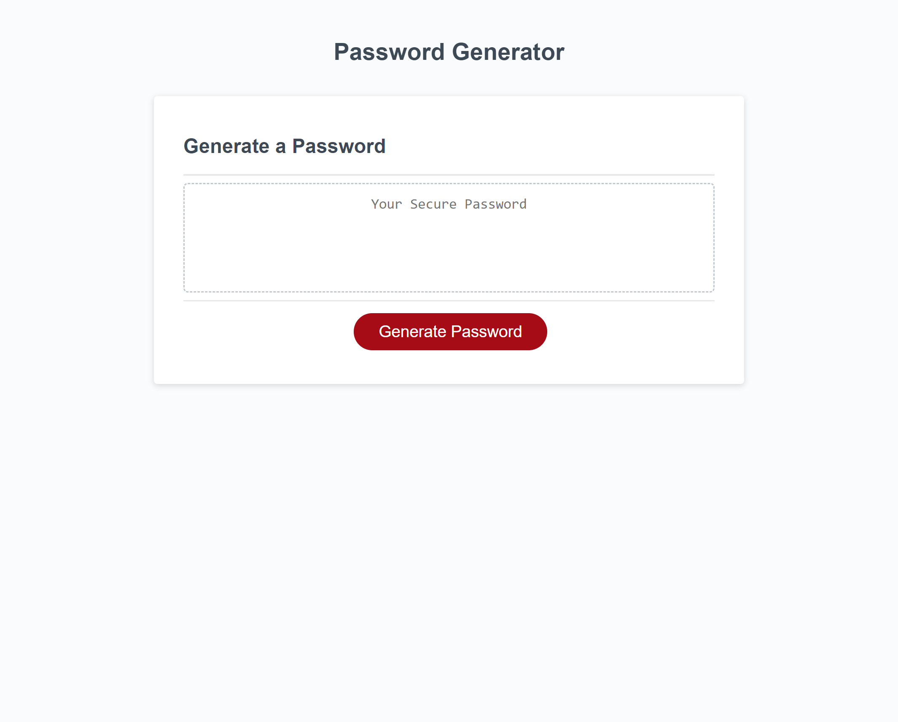

# random-password-generator

[Link to my project :https://elijahnance.github.io/random-password-generator/]
(https://elijahnance.github.io/random-password-generator/)

## Tables of Contents
- [Description]
- [Visuals]

##
This is a random password generator that I created by adding a function to pre-existing code. I started by declaring variables that I knew I'd need to meet the password criteria including letters, numbers, and special characters. Once those were declared I created if statements to gather which characters the user wanted in their password by adding confirmation windows. Next I attempted to give the user the option of 8-128 characters for their password. I started by creating a undefined variable and assigning it to a prompt so the user could choose their length with an if statement. I then realized that if the number was outside of the boundaries it continued through the next confirms and nothing happened if I entered a letter. I then altered my if statement to include an isNaN function to look for non numbers. After I wrapped it in a while loop so if the conditions weren't met the process would restart. Finally I had to be able to randomly select the characters needed based on the user's choices. I started with a for loop containing the passwordLength variable so the length would equate to the users choice. I then used the Math.floor(Math.random) function to give the index of a random character based off the seed data which was then picked by the substring function in the next line.

## Visuals

